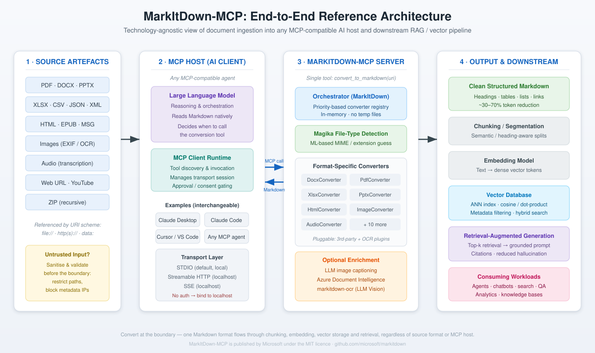
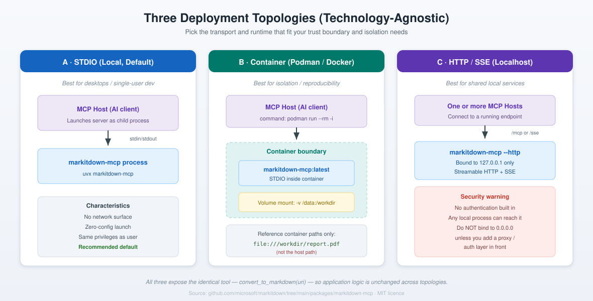

# MarkItDown-MCP Integration Guide

> A clear, validated, step-by-step guide to connecting Microsoft's **MarkItDown-MCP** server to any Model Context Protocol (MCP) compatible AI client, so your agents can convert documents into clean, token-efficient Markdown on demand.

[](LICENSE)
[](https://github.com/microsoft/markitdown)
[](https://modelcontextprotocol.io)
[](#)

---

## What this guide gives you

If you build anything on top of large language models, you pay per token for everything you place in the context window. A large share of that is markup the model never needs: the binary scaffolding of a `.docx`, the tag soup of HTML, the layout noise of a PDF. **MarkItDown-MCP** removes that overhead by converting source files into clean Markdown *at the boundary*, before the model ever reads them.

This repository is a practical, vendor-neutral playbook. It explains the architecture, walks you through installation on every major MCP host, and supplies ready-to-paste configuration templates. Every instruction here has been validated against the official `markitdown-mcp` package and the upstream Microsoft repository.

**Who this is for:** AI engineers, data scientists, platform teams, and anyone building retrieval-augmented generation (RAG) pipelines, document question-answering systems, or autonomous agents that need to read mixed-format files.

---

## The big idea in one diagram



MarkItDown-MCP sits between your messy source artefacts and your AI host. It exposes exactly **one tool**, `convert_to_markdown(uri)`, which any MCP-compatible agent can invoke mid-conversation. The Markdown that flows out is then ready for chunking, embedding, vector storage, and retrieval, a single uniform format regardless of where the data started life.

---

## Table of contents

| Document | What it covers |
| --- | --- |
| **[docs/01-overview.md](docs/01-overview.md)** | What MarkItDown and MCP are, and why the pairing matters |
| **[docs/02-architecture.md](docs/02-architecture.md)** | Reference architecture, sequence flow, and the vector-pipeline context |
| **[docs/03-prerequisites.md](docs/03-prerequisites.md)** | Exactly what you need installed before you begin |
| **[docs/04-installation.md](docs/04-installation.md)** | Step-by-step install for every transport and runtime |
| **[docs/05-client-integration.md](docs/05-client-integration.md)** | Connecting Claude Desktop, Claude Code, Cursor, VS Code, and generic MCP hosts |
| **[docs/06-validation-and-testing.md](docs/06-validation-and-testing.md)** | How to prove the integration works, with the MCP Inspector |
| **[docs/07-security.md](docs/07-security.md)** | Trust boundaries, hardening, and what the server will and will not do |
| **[docs/08-troubleshooting.md](docs/08-troubleshooting.md)** | The failure modes you will actually hit, and their fixes |
| **[docs/09-rag-pipeline-integration.md](docs/09-rag-pipeline-integration.md)** | Wiring the Markdown output into a vector database and RAG workflow |
| **[docs/10-faq.md](docs/10-faq.md)** | Common questions, answered concisely |

Configuration templates live under [`config-templates/`](config-templates/). Worked examples live under [`examples/`](examples/).

---

## Five-minute quick start

The fastest path uses `uvx`, which fetches and caches the package on first run with no manual virtual environment to manage. This works on Linux, macOS, and Windows.

**Step 1. Install `uv` (which provides `uvx`).**

```bash
# macOS / Linux
curl -LsSf https://astral.sh/uv/install.sh | sh

# Windows (PowerShell)
powershell -ExecutionPolicy ByPass -c "irm https://astral.sh/uv/install.ps1 | iex"
```

**Step 2. Confirm the server runs.** This command starts the server in STDIO mode and waits silently for a client; that silence is success. Press `Ctrl+C` to exit.

```bash
uvx markitdown-mcp
```

**Step 3. Register the server with your MCP host.** The canonical entry is identical across most hosts:

```json
{
  "mcpServers": {
    "markitdown": {
      "command": "uvx",
      "args": ["markitdown-mcp"]
    }
  }
}
```

**Step 4. Restart your host and ask it to convert a file.**

```
Convert file:///absolute/path/to/report.pdf to markdown and summarise the key points.
```

That is the whole loop. For per-client details, transport choices, and container deployment, continue to **[docs/04-installation.md](docs/04-installation.md)**.

---

## What the server actually does

`markitdown-mcp` is a thin MCP wrapper around the MarkItDown library. It exposes a single tool and speaks three transports.

| Property | Detail |
| --- | --- |
| **Tool** | `convert_to_markdown(uri)`, the only tool exposed |
| **Accepted URI schemes** | `http:`, `https:`, `file:`, `data:` |
| **Transports** | STDIO (default), Streamable HTTP, Server-Sent Events (SSE) |
| **Dependency** | Pins `markitdown[all]`, so every converter ships with it |
| **Python** | 3.10 or higher |
| **Licence** | MIT |
| **Conversion** | Performed in memory; no temporary files are written |

Supported source formats include PDF, Word (`.docx`), PowerPoint (`.pptx`), Excel (`.xlsx`, `.xls`), images (with EXIF and OCR), audio (with transcription), HTML, CSV, JSON, XML, EPUB, Outlook `.msg`, ZIP archives (processed recursively), and YouTube URLs.

> **Scope note.** The MCP tool deliberately exposes a single URI parameter. The library's advanced features, meaning large language model image captioning, Azure Document Intelligence and third-party plugins, do not cross the MCP boundary. If you need those, drive the Python library directly. This minimalism is a design strength: the model can never pick the wrong tool, and there is nothing to misconfigure.

---

## How it fits any MCP solution

The host is fully interchangeable. The same server, unchanged, serves Claude Desktop, Claude Code, Cursor, VS Code, and any other MCP-compliant agent. This is the entire point of the Model Context Protocol: a standard interface means a converter you configure once works everywhere.



---

## Contributing

Issues and pull requests are welcome. Please read [`CONTRIBUTING.md`](CONTRIBUTING.md) first. This guide documents an upstream Microsoft project; for bugs in MarkItDown itself, raise them at [microsoft/markitdown](https://github.com/microsoft/markitdown/issues).

## Licence

This documentation is released under the [MIT Licence](LICENSE), matching the upstream project. MarkItDown and MarkItDown-MCP are trademarks and products of Microsoft Corporation, used here under their [Trademark and Brand Guidelines](https://www.microsoft.com/en-us/legal/intellectualproperty/trademarks/usage/general).

## References and further reading

- Microsoft MarkItDown repository: https://github.com/microsoft/markitdown
- MarkItDown-MCP package source: https://github.com/microsoft/markitdown/tree/main/packages/markitdown-mcp
- MarkItDown-MCP on PyPI: https://pypi.org/project/markitdown-mcp/
- Model Context Protocol specification: https://modelcontextprotocol.io
- MCP Inspector tooling: https://github.com/modelcontextprotocol/inspector

---

## Disclaimer

General information only, offered as a community contribution rather than as professional advice. The views here are the author's own and are not those of any employer or client.

This guide asks you to install packages and to grant an AI client access to tools that can read files on your machine. Understand what a tool can reach before you enable it, and do not point it at anything sensitive while you are still testing.

No warranty is given, and no responsibility is accepted for any outcome. Full version: [DISCLAIMER.md](https://github.com/NeumannTechTips/neumanntechtips-resources/blob/main/DISCLAIMER.md)

---

## More from NeumannTechTips

This guide comes out of the work behind **[NeumannTechTips](https://www.youtube.com/@NeumannTechTips)**, a channel on practical AI for people who have to make it work inside a real organisation.

- 📺 **[youtube.com/@NeumannTechTips](https://www.youtube.com/@NeumannTechTips)** · a new video every other Thursday
- 📚 **[neumanntechtips-resources](https://github.com/NeumannTechTips/neumanntechtips-resources)** · free prompt packs and checklists, licensed CC BY 4.0, no sign up
