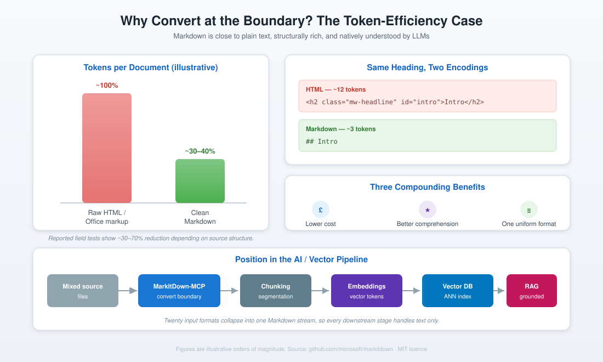

# 01 · Overview

## What is MarkItDown?

MarkItDown is a lightweight Python utility, published by Microsoft under the MIT licence, that converts a wide range of file formats into Markdown for use with large language models and text-analysis pipelines. It originated inside Microsoft Research as part of the AutoGen project, where the team needed a dependable way to feed varied documents to agents being evaluated on the GAIA benchmark. That heritage shapes its design priority: the output is meant for machine consumption, not pixel-perfect human presentation.

The library favours **structure over appearance**. A richly formatted brochure becomes plain paragraphs, but headings stay headings, tables stay tables, and lists stay lists. This is a deliberate trade. For an LLM, the semantic skeleton of a document matters far more than its visual styling.

## What is the Model Context Protocol (MCP)?

The Model Context Protocol is an open standard that lets AI applications (the *hosts*) connect to external tools and data sources (the *servers*) through a uniform interface. An MCP host discovers the tools a server offers, and the underlying model can then choose to invoke them during a conversation. Because the interface is standardised, a server you build or configure once works across every compliant host without modification.

In practical terms: instead of writing a bespoke integration for each AI client, you expose your capability as an MCP server, and Claude Desktop, Claude Code, Cursor, VS Code, and others can all use it identically.

## What is MarkItDown-MCP?

`markitdown-mcp` is the official package that wraps the MarkItDown library as an MCP server. It exposes a single tool, `convert_to_markdown(uri)`, and accepts `http:`, `https:`, `file:`, and `data:` URIs. It speaks three transports — STDIO, Streamable HTTP, and SSE — and it pins `markitdown[all]` as a dependency, so the full converter set ships with it. You never have to chase missing format extras.

## Why convert at the boundary?

The argument rests on three compounding benefits.

**Lower cost.** Markdown is close to plain text. A Markdown heading such as `## Introduction` costs a couple of tokens; the equivalent HTML, `<h2 class="mw-headline" id="intro">Introduction</h2>`, costs roughly a dozen. Multiplied across an entire document, the saving is substantial. Reported field tests on structure-heavy web pages show token reductions in the region of 30 to 70 per cent.

**Better comprehension.** Mainstream models were trained on vast quantities of Markdown drawn from sources such as code repositories and technical documentation. They parse it natively. Feeding a model Markdown rather than raw markup means it spends fewer tokens *and* understands the structure more reliably.

**One uniform format.** Twenty input formats collapse into a single Markdown stream. Everything downstream — your chunker, your embedding step, your prompts — only ever has to deal with text. Your pipeline no longer needs to know whether a document began life as a PDF, a spreadsheet, or a web page.

## Where it sits in the wider pipeline

In a retrieval-augmented generation system, MarkItDown-MCP is the ingestion and normalisation layer. Clean Markdown emerges from conversion, is split into semantically coherent chunks, is transformed into dense vector embeddings, and is stored in a vector database. At query time, the most relevant chunks are retrieved by approximate nearest-neighbour search and supplied to the model as grounded context. See **[09-rag-pipeline-integration.md](09-rag-pipeline-integration.md)** for the full treatment.

## What it is not

- It is **not** a high-fidelity document renderer. Do not use it to produce documents for human publication.
- It does **not** write `.docx` or PDF. The conversion is strictly *files to Markdown*; the reverse direction belongs to tools such as Pandoc.
- The MCP tool does **not** expose OCR, image captioning, Azure Document Intelligence, or plugins. Those live in the Python library only.
- It has **no** built-in OCR on the PDF path. A scanned, image-only PDF with no text layer will return empty. For those, use the Python library with Azure Document Intelligence or a dedicated OCR step.

## References

- MarkItDown repository — https://github.com/microsoft/markitdown
- MarkItDown-MCP package — https://github.com/microsoft/markitdown/tree/main/packages/markitdown-mcp
- Model Context Protocol — https://modelcontextprotocol.io
