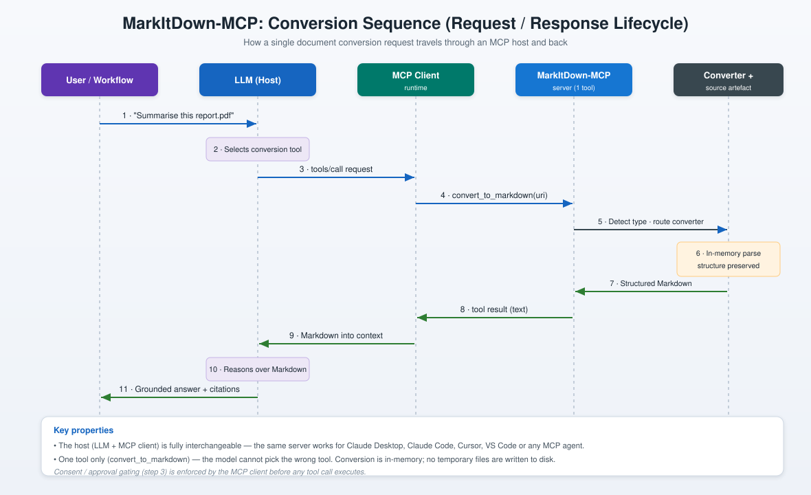

# 02 · Architecture

This document describes how MarkItDown-MCP is structured, how a single conversion request travels through the system, and how the output integrates with a downstream vector and retrieval pipeline. The diagrams are deliberately technology-agnostic: substitute your own host, embedding model, or vector database without changing the shape of the flow.

## Reference architecture

The system divides cleanly into four tiers.

**Tier 1 — Source artefacts.** Any supported file or remote resource, referenced by URI scheme (`file://`, `http(s)://`, or `data:`). Where input is untrusted, it must be sanitised and validated *before* it reaches the conversion boundary: restrict permitted paths, limit URI schemes and network destinations, and block private, loopback, link-local, and metadata-service addresses.

**Tier 2 — MCP host (AI client).** The host pairs a large language model with an MCP client runtime. The model reasons about the task and decides when a file needs converting; the client runtime handles tool discovery, invocation, consent gating, and the transport session. This tier is fully interchangeable — the same server serves Claude Desktop, Claude Code, Cursor, VS Code, or any other compliant agent.

**Tier 3 — MarkItDown-MCP server.** The server receives the `convert_to_markdown(uri)` call and hands it to the MarkItDown orchestrator. The orchestrator uses ML-based file-type detection (Magika) to identify the format, then routes the stream through a priority-ordered registry of format-specific converters. Conversion is performed in memory. Optional enrichment — LLM image captioning, Azure Document Intelligence, or the OCR plugin — is available only through the Python library, not the MCP tool.

**Tier 4 — Output and downstream.** Clean, structured Markdown emerges, ready for chunking, embedding, vector storage, retrieval, and the consuming workload (agents, chatbots, search, analytics, or knowledge bases).

## Conversion sequence

The following sequence shows the full request and response lifecycle for one document conversion.

1. The user or an automated workflow asks the host to work with a file.
2. The model recognises that conversion is required and selects the tool.
3. The MCP client issues a `tools/call` request, subject to any consent gating.
4. The request reaches the server as `convert_to_markdown(uri)`.
5. The server detects the file type and routes it to the correct converter.
6. The converter parses the artefact in memory, preserving document structure.
7. Structured Markdown is returned to the server.
8. The server returns the tool result as text.
9. The Markdown is injected into the model's context.
10. The model reasons over clean Markdown rather than raw markup.
11. A grounded answer, with citations where applicable, is returned to the user.

The two properties worth internalising: the host is interchangeable, and there is exactly one tool, so the model can never invoke the wrong one. Conversion never touches the disk with temporary files.

## Internal converter design

Within the MarkItDown library, every format is handled by a dedicated converter class that implements a common `DocumentConverter` interface. Converters are held in a priority-ordered registry. Specific-format converters (for `.docx`, `.pdf`, `.xlsx`, and so on) take precedence over generic, catch-all converters (such as the plain-text fallback). When a conversion is attempted, the registry is consulted in priority order until a converter accepts the stream. If none does, a typed exception is raised rather than a silent failure.

This modular design is also the extension point. Third-party plugins register additional converters through Python's entry-point mechanism, and the first-party OCR plugin inserts OCR-enhanced converters ahead of the built-in ones. None of this is exposed across the MCP boundary, but it explains how the underlying engine achieves its breadth of format support.

## Deployment topologies

Three topologies cover essentially every need. They share the identical tool surface, so your application logic does not change between them.

- **STDIO (local, default).** The host launches the server as a child process and communicates over standard input and output. No network surface, zero configuration. This is the recommended default for desktops and single-user development.
- **Container (Podman or Docker).** The server runs inside a container for isolation and reproducibility, communicating over STDIO within the container boundary. Local files must be made available through a volume mount, and you reference container paths rather than host paths.
- **HTTP / SSE (localhost).** The server runs as a persistent local endpoint that one or more hosts connect to. It binds to localhost by default. Because it ships with no authentication, it must never be bound to a public interface without an external authentication layer in front of it.

See **[04-installation.md](04-installation.md)** for the exact commands for each.

## References

- Architecture deep-dive (community) — https://deepwiki.com/microsoft/markitdown/1.1-architecture
- MarkItDown-MCP package — https://github.com/microsoft/markitdown/tree/main/packages/markitdown-mcp
- Model Context Protocol — https://modelcontextprotocol.io
